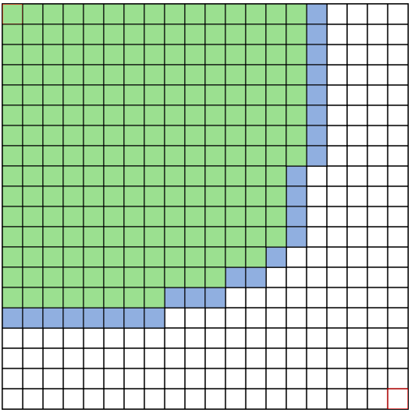

# A* Pathfinding Algorithm Visualization

Follow-along of this Coding Train challenge: [#51 — A* Pathfinding Algorithm](https://thecodingtrain.com/challenges/51-a-pathfinding-algorithm)

## Getting Started

1. Clone the repo.
2. Run `corepack enable` to enable corepack.
3. Run `corepack install` to install pnpm.
4. Run `pnpm install` to install dependencies.
5. Run `pnpm dev` to start the local server.